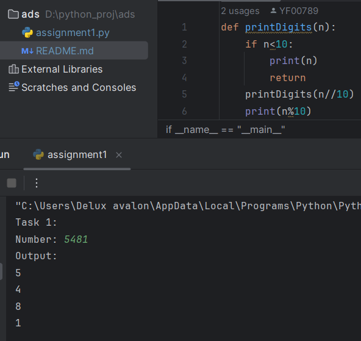
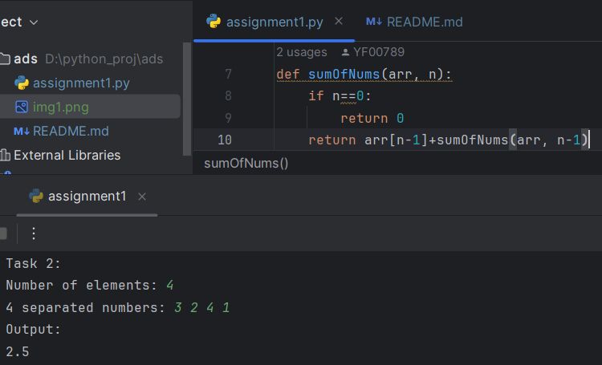
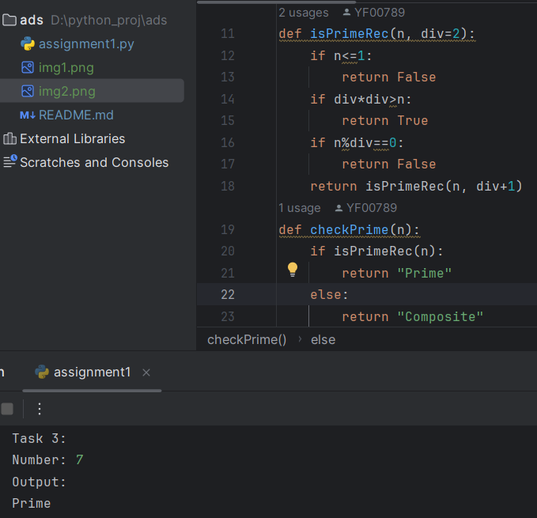
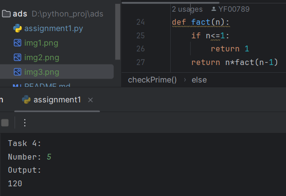
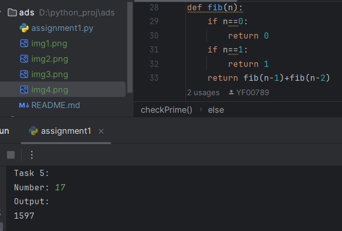
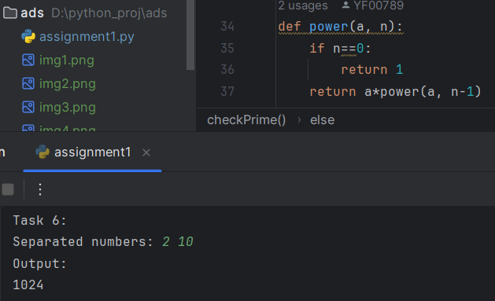
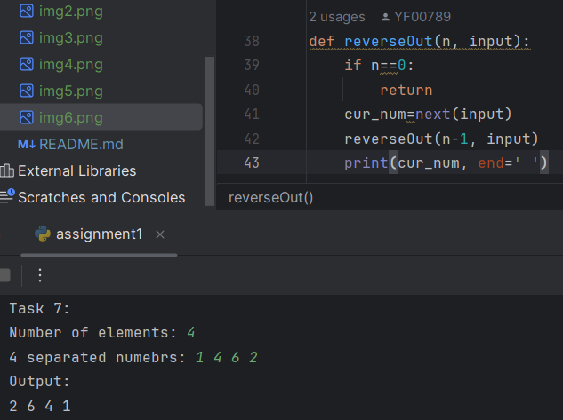
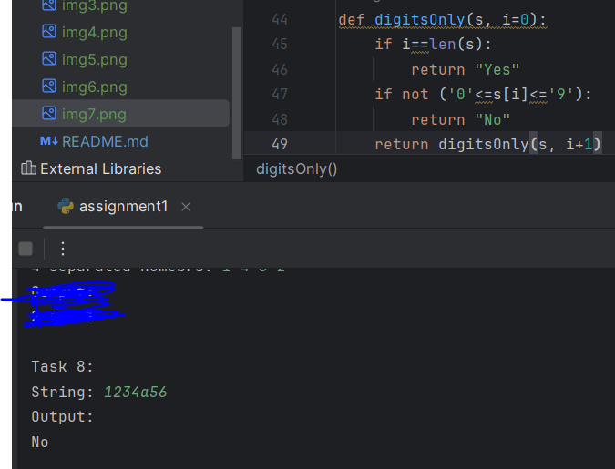
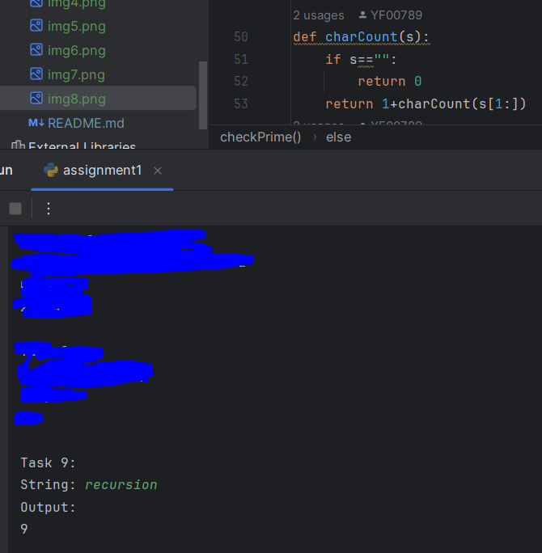
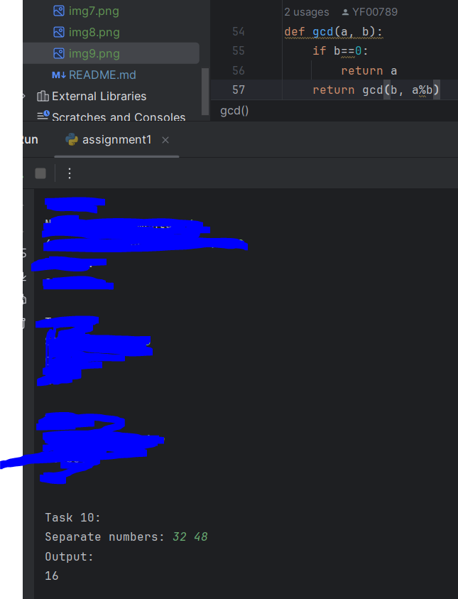

# Assignment №1: Recursion

**Name:** ILYA DYRYLO
**Group:** SE-2511

## Summary
I simply implemented the existed math formulas by breaking them down into smaller operations and adapting them to recursion algorithms.

### Task 1:
The function uses basic division to recursively go from the last to first digit of the number and prints them out one by one. Base case triggers when `n < 10`, letting the program continue.

### Task 2:
The base case returns 0 when n == 0. The recursive step adds the current element to the sum of the remaining ones. Average is then calculated based off of the sum by dividing it by the amount of elements from the initial input.

### Task 3:
Two functions are used: a recursive helper and a formatter. The helper checks divisibility by incrementing div. Base cases immediately returns False if n is composite or True if the prime condition is met.

### Task 4:
The function simply multiplies n by fact(n-1). The base case stops the recursion by returning 1 when n <= 1.

### Task 5:
The function strictly maps to the definition of the Fibonacci sequence. The base cases are n == 0 returns 0 and n == 1 returns 1. The recursive step returns the sum of the previous two results of the same function.

### Task 6:
The function calculates powers recursively by returning multiplication of the base by the power(a, n-1). The base case stops the sequence by returning 1 when the exponent equals to 0.

### Task 7:
The function reads numbers sequentially from an iterator stream. It stores the current item, recursively calls itself for the remaining n-1 inputs, and prints the stored item. Because printing happens after the call, the numbers are printed in reverse order without using an extra array.

### Task 8: 
The function evaluates characters recursively using index i. If i reaches the string's length, it means no non-digits were found, so it returns "Yes". If s[i] falls outside 0 to 9 range, it returns "No". The recursive call increments the index by 1.

### Task 9:
The function uses string slicing. The base case evaluates if the string is empty, returning 0. The recursive step returns 1 + charCount(s[1:]), stripping the first character off the string on every deeper call.

### Task 10:
The function uses the Euclidean Algorithm recursively. If b equals to 0, a is the GCD. The recursive step calls gcd(b, a % b).

