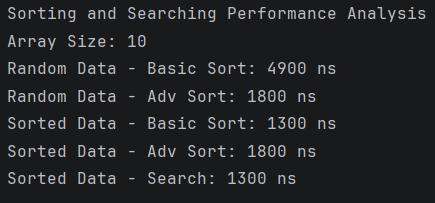
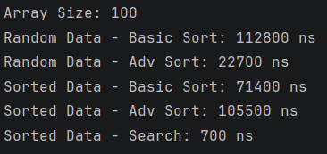
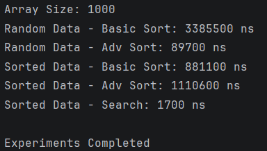

## A. Overview
*   **Basic Sort:** Bubble Sort
*   **Advanced Sort:** Quick Sort
*   **Search Algorithm:** Binary Search

**Purpose of the Experiment:**
Practical evaluation of the Big-O time complexities of these algorithms by running a small series of tests with arrays of different sizes and data states and analyzing how various conditions impact execution time.

---

## B. Algorithm Descriptions

### 1. Bubble Sort
*   **How it works:** It repeatedly iterates through the list, comparing neighbor elements and swapping them if they are in the wrong order.
*   **Time Complexity:** O(n²) for every possible case.

### 2. Quick Sort
*   **How it works:** It selects a pivot element and partitions the array so that smaller elements are moved to the left of the pivot and larger elements to the right. It then recursively applies this logic to the left and right sub-arrays.
*   **Time Complexity:** O(n log n) for Best and Average cases. O(n²) for the Worst case - an already sorted array.

### 3. Binary Search
*   **How it works:** It searches a sorted array by comparing the target value to the middle element. If they match, the index is returned, if the target is smaller, the search continues in the left half; if larger, it continues in the right half.
*   **Time Complexity:** O(log n) for Average and Worst cases; O(1) for the Best case (if the target is exactly in the middle).

---

## C. Experimental Results

### Execution Time Table

| Array Size | Data State | Bubble Sort  | Quick Sort   | Binary Search |
|:-----------|:-----------|:-------------|:-------------|:--------------|
| 10         | Random     | 4,900 ns     | 1,800 ns     | N/A           |
|            | Sorted     | 1,300 ns     | 1,800 ns     | 1,300 ns      |
| 100        | Random     | 112,800 ns   | 22,700 ns    | N/A           |
|            | Sorted     | 71,400 ns    | 105,500 ns   | 700 ns        |
| 1000       | Random     | 3,385,500 ns | 89,700 ns    | N/A           |
|            | Sorted     | 881,100 ns   | 1,110,600 ns | 1,700 ns      |

### Data Processing Analysis

1.  Quick Sort outperformed Bubble Sort on random data as array sizes grew. This happens because Quick Sort divides the problem into smaller chunks iteratively `O(n log n)`, while Bubble Sort compares every element multiple times `O(n²)`.
2.  As input size increases by a factor of 10, Bubble Sort's execution time increases by a factor of 100. Quick Sort's time on random data scaled a lot slower in a nearly linear way.
3.  Because this implementation doesn't check if the array is pre-sorted, it runs at nearly the same speed for both. Quick Sort performed significantly worse on sorted data compared to random data. This is because the partition algorithm strictly picks the last element (`arr[high]`) as the pivot. In an already sorted array, this pivot is always the maximum element, resulting in an unbalanced split `(0 elements on the right, n-1 on the left)`, degrading Quick Sort to O(n²) complexity.
4.  Yes. The exponential spike in Bubble Sort times matches the O(n²) expectation. The slow scaling of Quick Sort on random arrays matches `O(n log n)`, and its severe degradation on sorted arrays perfectly validates the theoretical `O(n²)` worst-case scenario.
5.  Binary search is really efficient. Even when increasing the array from 100 to 1000 elements, the execution time barely changes. Because it operates at `O(log n)`, an array of 1000 elements requires at most ~10 checks, while an array of 1,000,000 elements only takes ~20 checks.
6.  Binary search depends on strict logical elimination. When checking the midpoint, it discards half of the array based on the guarantee that all items to the left are smaller and all items to the right are larger. If the array is unsorted, this guarantee disappears, and the algorithm will fail to find the target.

---

## D. Screenshots

---

## E. Reflection

From completing this assignment I saw a practical perspective on how theoretical algorithmic concepts translate to real hardware execution. Measuring in nanoseconds highlighted for me that Big-O complexity isn't just an abstract mathematical concept, but a real reflection of software scalability. Seeing Quick Sort outperform Bubble Sort on large random arrays demonstrated the actual capabilities of divide-and-conquer strategies.

My biggest takeaway was the difference between theoretical performance and implementation reality. The discovery that Quick Sort performed terribly on pre-sorted data was a surprising but great lesson on worst-case scenarios. Because the partition method blindly trusts the final element as the pivot, it created entirely unbalanced sub-arrays. It proved that a "faster" algorithm can easily become a bottleneck if edge cases aren't considered. Overcoming the challenge of ensuring array copies were made using `Arrays.copyOf()` so sorting operations didn't overwrite the data meant for the next test was also an important part of successfully structuring these experiments.