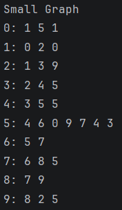
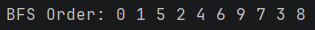
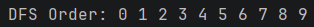
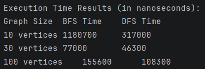

# Assignment 4: Graph Traversal and Analysis

## A. Project Overview
This project implements a non-linear graph to and analyze Breadth-First Search and Depth-First Search, where a graph consists of nodes that hold unique identifiers and Edges representing the connections between these nodes with the objective to compare performance of both algorithms with different graph sizes.

## B. Class Descriptions
* **Vertex**: A node in the graph. Has a private integer field `id`, initialized via its constructor, alongside standard getter and `toString()` methods.
* **Edge**: Defines a link between two vertices. It holds `source` and `destination` vertex objects representing where the edge starts and ends.
* **Graph**: Manages the network of vertices and edges using an Adjacency List. The adjacency list pairs a vertex's ID with a list of its connected edges, ensuring optimal space efficiency. It contains methods to add vertices, add undirected edges, print the graph, and trigger `bfs` and `dfs` traversals.
* **Experiment**: Manages the benchmarking and testing. It dynamically creates graphs of sizes 10, 30, and 100, executing traversals and measuring execution time in nanoseconds.
* **Main**: Project entry point, executes `runMultipleTests` and `printResults` from the `Experiment` class.

## C. Algorithm Descriptions

### BFS
* **Step-by-step**: Begins at a root node and adds it to a Queue. It dequeues a node, marks it as visited, and iteratively enqueues all of its unvisited neighboring nodes. It explores the graph evenly level by level until the queue is empty.
* **Use Cases**: Finding the shortest path on unweighted graphs, peer-to-peer networking, and GPS navigation systems.
* **Time Complexity**: O(V+E) where V is vertices and E is edges.

### DFS
* **Step-by-step**: Begins at a root node, marks it as visited, and then recursively visits the first unvisited neighbor node it finds, diving as deep as possible into a branch. When it reaches a dead end, it backtracks to explore the next available branch.
* **Use Cases**: Topological sorting, maze solving algorithms, and detecting cycles in graphs.
* **Time Complexity**: O(V+E) where V is vertices and E is edges.

## D. Experimental Results & Analysis

### Execution Time Comparison

| Graph Size   | BFS Time (ns) | DFS Time (ns) |
|--------------|---------------|---------------|
| 10 vertices  | 1,180,700     | 317,000       |
| 30 vertices  | 77,000        | 46,300        |
| 100 vertices | 155,600       | 108,300       |

### Analysis Questions
1. The execution time for both algorithms scales linearly as the graph size grows.
2. DFS is faster because it uses the recursion, bypassing the overhead required to instantiate and poll from a `LinkedList` Queue in BFS.
3. Yes, the time increment between 10, 30, and 100 vertices demonstrates a linear progression mirroring the total counts of Vertices and Edges.
4. A dense graph with many edges gives BFS more nodes to process per level, making it wider. In DFS, density opens multiple branch choices quickly, making backtracks happen closer to the root.
5. BFS is strictly preferred when seeking the shortest path in unweighted graphs or when the target node is known to be close to the root.
6. DFS is not reliable for shortest-path finding. And a heavily deep structures can trigger a `StackOverflowError` because of deep recursion limits.

## E. Screenshots

* **Graph Structure Output**: 
* **BFS Traversal Output**: 
* **DFS Traversal Output**: 
* **Performance Results**: 

## F. Reflection
I understood how graph structures work in code, learned how adjacency lists offer a scalable alternative to matrices.

The main difference between BFS and DFS was purely structural—BFS queues sibling nodes, while DFS tracks down singular paths via memory recursion. The most prevalent challenge was figuring out proper recursion algorithms for both BFS and DFS.
